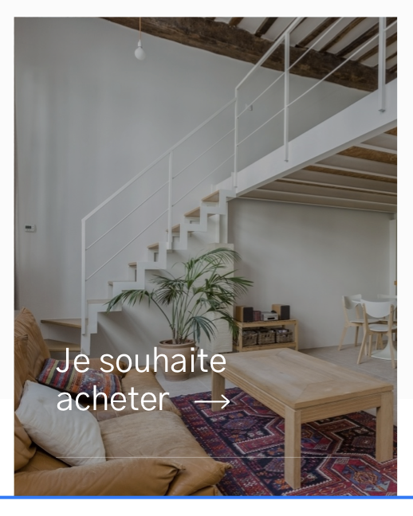

# Lien interne

---



## Propriétés

---

|nom|type|requis|default|description| 
|---|---|---|---|---|
image|[Image](/composants/image)|oui|null|Une image de fond
title|Chaîne de caractères|oui|""|Le titre
link|Objet avec `to` et `title`|non|null|Le lien à afficher

## Composants

---

- [Image](/composants/image)

## API

---

```js
{
  image: {
    // voir composant Image
    sources: [__image__, __image_en_webp__],
    alt: 'une maison'
  },
  title: 'Je souhaite acheter',
  link: {
    title: 'Aller à la page Acheter',
    to: '/acheter'
  }
}
```
