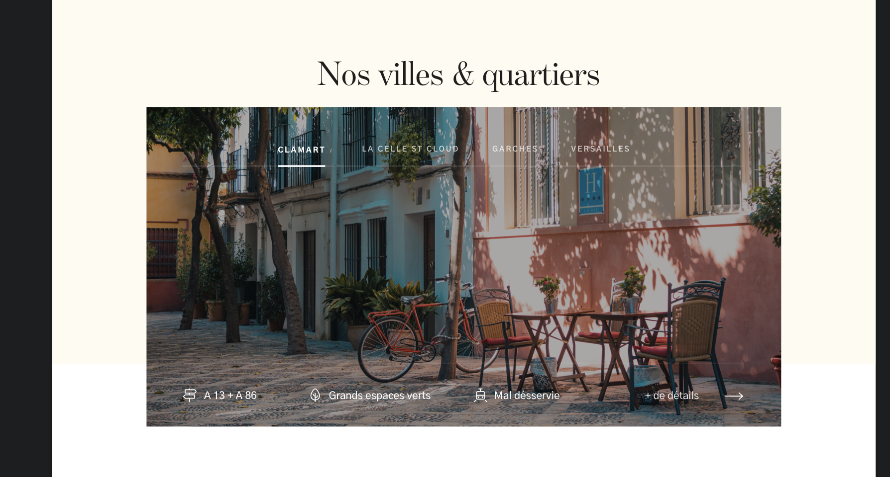

# Liste de villes 

---



## Propriétés

---

|nom|type|requis|default|description| 
|---|---|---|---|---|
|items|Tableau de villes|oui|[]|Les villes affichées
title|Chaîne de caractères|oui|""|Le titre
link|Objet avec `to` et `title`|non|null|Le lien à afficher
facilities|Tableaux d'objets|non|[]|Les avantages du quartier


## Comportement

---

- Si `items` a plus d'1 élément, on affiche la nav

## API

---

```js
{
  title: 'Nos villes & quartiers',
  items: [{
    title: 'Clamart',
    image: {
      sources: [__image__, __image_en_webp__],
      alt: 'le quartier'
    },
    link: {
      to: '__slug_de_la_ville__',
      title: 'Voir la ville Clamart'
    },
    facilities: [{
      text: 'A13 + A86',
      icon: 'highway'
    }, {
      text: 'Grands espaces verts',
      icon: 'tree'
    }, {
      text: 'Mal desservie',
      icon: 'subway'
    }]
  }],
  ...
}
```
