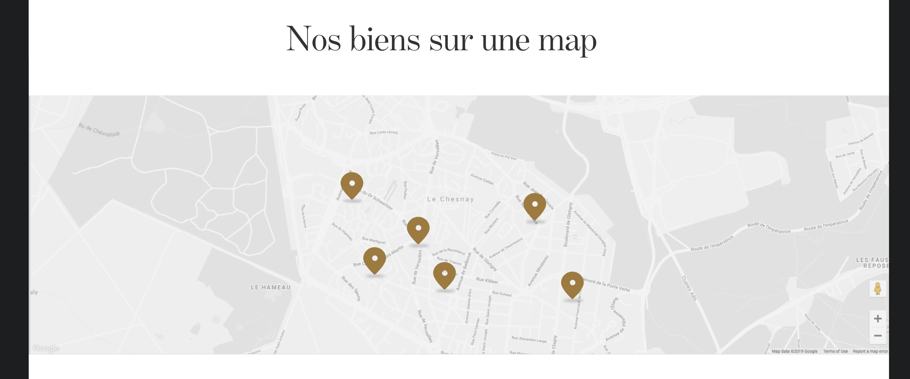
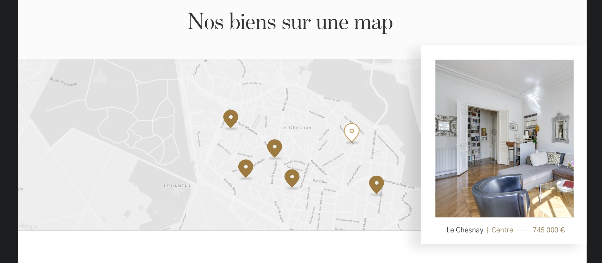

# Carte

---

## Propriétés

---

| nom   | type                 | requis | default | description                                             |
| ----- | -------------------- | ------ | ------- | ------------------------------------------------------- |
| title | Chaîne de caractères | non    | ""      | Le titre                                                |
| items | Tableau de données   | non    | []      | Les données qui vont construire les markers et la popup |

## Composants

---

- [Lien vignette](/2-cutting/composants/lien-vignette)

## Comportement

---
