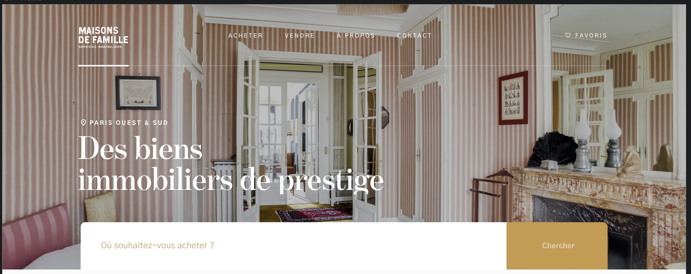

# Header

---




## Propriétés

---

| nom      | type                                 | requis | default | description                     |
| -------- | ------------------------------------ | ------ | ------- | ------------------------------- |
| images   | Tableau d'[Image](/2-cutting/composants/image) | non    | []      | Une ou plusieurs images de fond |
| video    | Une [Video](/2-cutting/composants/video)       | non    | []      | Une video de fond               |
| title    | Chaîne de caractères                 | oui    | null    | Le titre                        |
| subtitle | Chaîne de caractères                 | non    | null    | Le sous titre                   |


## Composants

---

- [Image](/2-cutting/composants/image)
- [Video](/2-cutting/composants/video)


## Comportement

---

- Si on a plusieurs photos, on a des flèches pour changer de photo

## API

---

```js
{
  images: [
    // voir composant Image
    {
      sources: [__image__, __image_en_webp__],
      alt: 'une maison'
    }
  ],
  title: 'Des biens immobiliers de prestige',
  subtitle: 'Paris ouest & sud'
}
```
