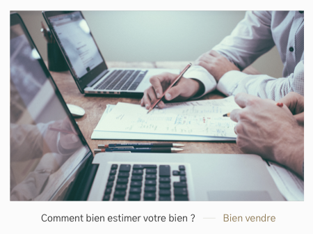
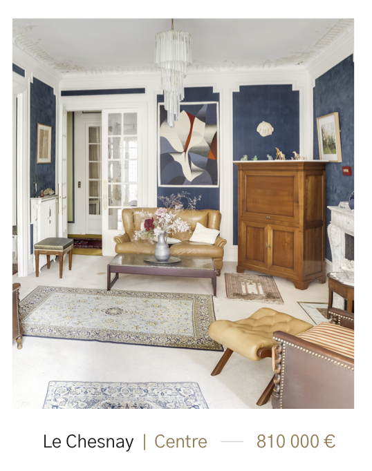

# Lien vignette

---




## Propriétés

---

|nom|type|requis|default|description| 
|---|---|---|---|---|
images|Tableau d'[Image](/2-cutting/composants/image)|oui|[]|Une/Les image(s) de fond
type|Chaîne de caractères|oui|[]|Le type de vignette. `possession`, `news`, `city`, ou `advisor`
link|Objet avec `to` et `title`|non|null|Le lien à afficher
name|Chaîne de caractères|non|""|Le nom du conseiller si le type est `advisor`
agency|Chaîne de caractères|non|""|L'agence du conseiller si le type est `advisor`
city|Chaîne de caractères|non|""|La ville du bien si le type est `possession` ou `city`
district|Chaîne de caractères|non|""|Le quartier du bien si le type est `possession`
price|Chaîne de caractères|non|""|Le prix du bien si le type est `possession`
possessionsNumber|Chaîne de caractères|non|""|Le nombre de biens en vente si le type est `city`
title|Chaîne de caractères|non|""|Le titre de l'actualité si le type est `news`
category|Chaîne de caractères|non|""|La catégorie de l'actualité si le type est `news`

## Composants

---

- [Image](/2-cutting/composants/image)


## Comportement

---

- Si on a plusieurs photos, on a des flèches pour changer de photo
- Si c'est un bien, on peut l'ajouter au favoris

## API

---

```js
// Un bien
{
  type: 'possession',
  link: {
    to: '__slug__',
    title: 'Voir le bien'
  }
  city: 'Le chesnay',
  district: 'Centre',
  price: 810000,
  images: [{
    sources: [__image__, __image_en_webp__],
    alt: 'une maison'
  }]
}

// Une actualité
{
  type: 'news',
  link: {
    to: '__slug__',
    title: 'Voir l\'actualite'
  }
  title: 'Nathalie nous parle de sa vente',
  category: 'Rencontres',
  images: [{
    sources: [__image__, __image_en_webp__],
    alt: 'une maison'
  }]
}

// Une ville
{
  type: 'city',
  link: {
    to: '__slug__',
    title: 'Voir la ville'
  }
  city: 'Le chesnay',
  possessionNumber: 8,
  images: [{
    sources: [__image__, __image_en_webp__],
    alt: 'une maison'
  }]
}

// Un conseiller
{
  type: 'advisor',
  link: {
    to: '__slug__',
    title: 'Voir le conseiller'
  }
  name: 'Edouard Danvy',
  agency: 'Haut-de-seine',
  images: [{
    sources: [__image__, __image_en_webp__],
    alt: 'edouard'
  }]
}
```
