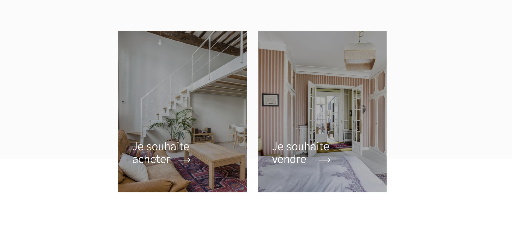

# Liste de liens interne

---



## Propriétés

---

| nom   | type            | requis | default | description |
| ----- | --------------- | ------ | ------- | ----------- |
| links | Tableau de lien | oui    | []      | Les liens   |

## Composants

---

- [Lien interne](/2-cutting/composants/lien-interne)


## Comportement

---


## API

---

```js
{
links: [{
          image: {
            alt: 'mon alt',
            base: {
              source: 'https://picsum.photos/900/400'
            },
            jpg: [{
              source: 'https://picsum.photos/900/400',
              width: 350
            }, {
              source: 'https://picsum.photos/900/400',
              width: 700
            }, {
              source: 'https://picsum.photos/900/400',
              width: 1400
            }],
            webp: [{
              source: 'https://picsum.photos/900/400',
              width: 350
            }, {
              source: 'https://picsum.photos/900/400',
              width: 700
            }, {
              source: 'monimage_1400.webp',
              width: 1400
            }]
          },
          title: 'Je souhaite acheter',
          link: {
            to: 'acheter',
            title: ''
          }
        }, {
          image: {
            alt: 'mon alt',
            base: {
              source: 'https://picsum.photos/900/400'
            },
            jpg: [{
              source: 'https://picsum.photos/900/400',
              width: 350
            }, {
              source: 'https://picsum.photos/900/400',
              width: 700
            }, {
              source: 'https://picsum.photos/900/400',
              width: 1400
            }],
            webp: [{
              source: 'https://picsum.photos/900/400',
              width: 350
            }, {
              source: 'https://picsum.photos/900/400',
              width: 700
            }, {
              source: 'monimage_1400.webp',
              width: 1400
            }]
          },
          title: 'Je souhaite vendre',
          link: {
            to: 'vendre',
            title: ''
          }
        }]
}
```
