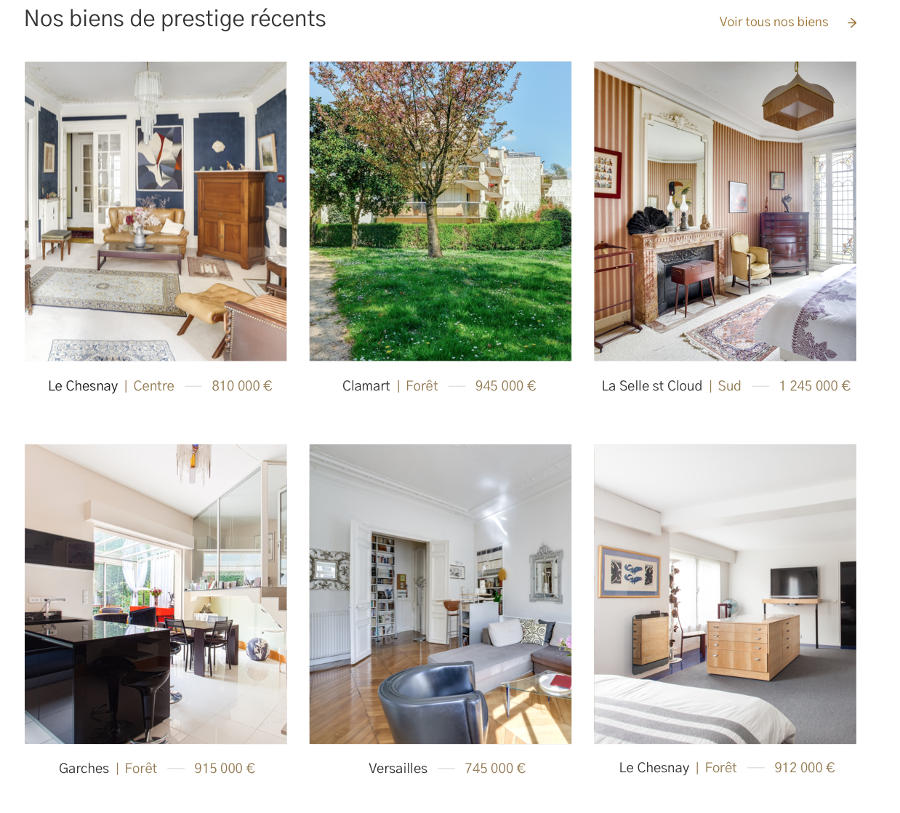

# Liste de liens vignettes 

---



## Propriétés

---

|nom|type|requis|default|description| 
|---|---|---|---|---|
|items|Tableau de [Lien vignette](/2-cutting/composants/thumbnail)|oui|[]|Les liens vignettes affichés
title|Chaîne de caractères|oui|""|Le titre
link|Objet avec `to`, `text` et `title`|non|null|Le lien à afficher
canBeSorted|Booléen|non|false|Si on peut trier la liste
map|Référence au composant [Carte](/2-cutting/composants/map)|non|null|Référence à la carte associée


## Comportement

---

- Si `canBeSorted` est vrai, on affiche le tri
- Si `map` est défini, on affiche un lien qui scroll vers la carte
- Si `link` est défini, on affiche un lien qui pointe vers le lien

## API

---

```js
{
  title: 'Nos biens récents',
  link: {
    to: '/achat',
    title: 'Aller à la page achat',
    text: 'Voir tous nos biens'
  },
  // voir lien vignette
  items: [{
    // voir image
    images: [{
      sources: [__image__, __image_en_webp__],
      alt: 'une maison'
    }],
    title: 'Je souhaite acheter',
    link: {
      title: 'Aller à la page Acheter',
      to: '/acheter'
    }
  }, {
    images: [{
      sources: [__image__, __image_en_webp__],
      alt: 'une maison'
    }],
    title: 'Je souhaite acheter',
    link: {
      title: 'Aller à la page Acheter',
      to: '/acheter'
    }
  }]
}
```
