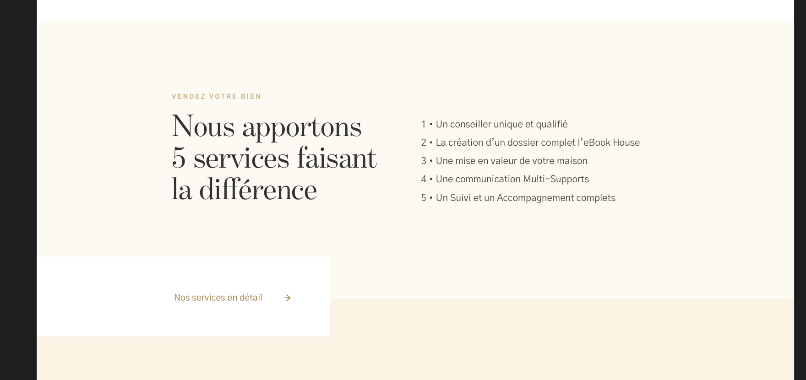

# Section lien

---



## Propriétés

---

|nom|type|requis|default|description| 
|---|---|---|---|---|
title|Chaîne de caractères|oui|null|Le titre affiché
subtitle|Chaîne de caractères|oui|""|Le sous-titre affiché
link|Objet avec les propriétés `type`, `to`, `text` |non|null|Le lien affiché
services|Tableau|non|[]|La liste de points importants


## Composants

---

- [Image](/2-cutting/composants/image)


## API

---

```js
{
  title: 'Nous apportons 5 services faisant la différence ',
  subtitle: 'VENDEZ VOTRE BIEN',
  link: {
    to: 'services',
    title: 'Voir nos services',
    text: 'Nos services en détail'
  },
  services: [
    'Un conseiller unique et qualifié',
    'La création d’un dossier complet l’eBook House',
    'Une mise en valeur de votre maison',
    'Une communication Multi-Supports',
    'Un Suivi et un Accompagnement complets'
  ]
}
```
