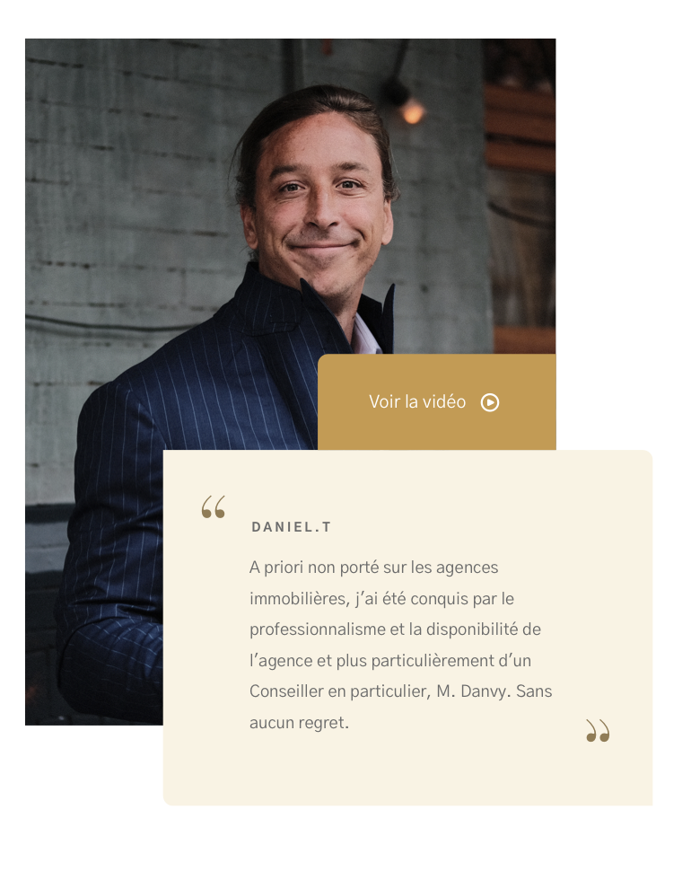

# Témoignage

---



## Propriétés

---

|nom|type|requis|default|description| 
|---|---|---|---|---|
type|Chaîne de caractères|oui|"quote"|Le type de témoignage. `quote` ou `press`
image|[Image](/2-cutting/composants/image)|oui|null|Une image de fond
layout|Chaîne de caractères|oui|"right"|`right` ou `left` change le layout
author|Chaîne de caractères|non|null|L'auteur de la citation
quote|Chaîne de caractères|non|null|La citation
link|Objet avec les propriétés `type`, `to`, |non|null|L'article si le type est `press`. peut être `{type: 'image', images: [] }` ou `{type: 'external', to: __url__}`


## Composants

---

- [Image](/2-cutting/composants/image)


## Comportement

---

- Si le type est `quote` et on a une vidéo, on affiche un bouton `voir la vidéo`
- Si le type est `press`, on affiche un bouton `Lire l'article`
- Si le type est `press` et `link.type` est `image`, `Lire l'article` affiche une popup de l'image de l'article
- Si le type est `press` et `link.type` est `link`, `Lire l'article` ouvre un nouvel onglet vers l'article

## API

---

```js
// Un témoignage
{
  type: 'quote',
  images: {
    sources: [__image__, __image_en_webp__],
    alt: 'l\'auteur de la citation'
  },
  layout: 'left',
  author: 'Daniel t.',
  quote: 'A priori non porté sur les agences immobilières, j\'ai été conquis par le professionnalisme et la disponibilité de l\'agence et plus particulièrement d\'un Conseiller en particulier, M. Danvy. Sans aucun regret.'
}

// Un article de presse
{
  type: 'press',
  images: {
    sources: [__image__, __image_en_webp__],
    alt: 'image de l\'article'
  },
  layout: 'left',
  author: 'Libération',
  quote: 'L’agence Maisons de Famille apporte un vrai coup de frais dans le monde de l’immobilier en restant connecté !',
  link: {
    type: 'external',
    to: 'http://liberation.fr/cdcdjncdjcbsdjhbcvdhjsbc'
  }
}
```
