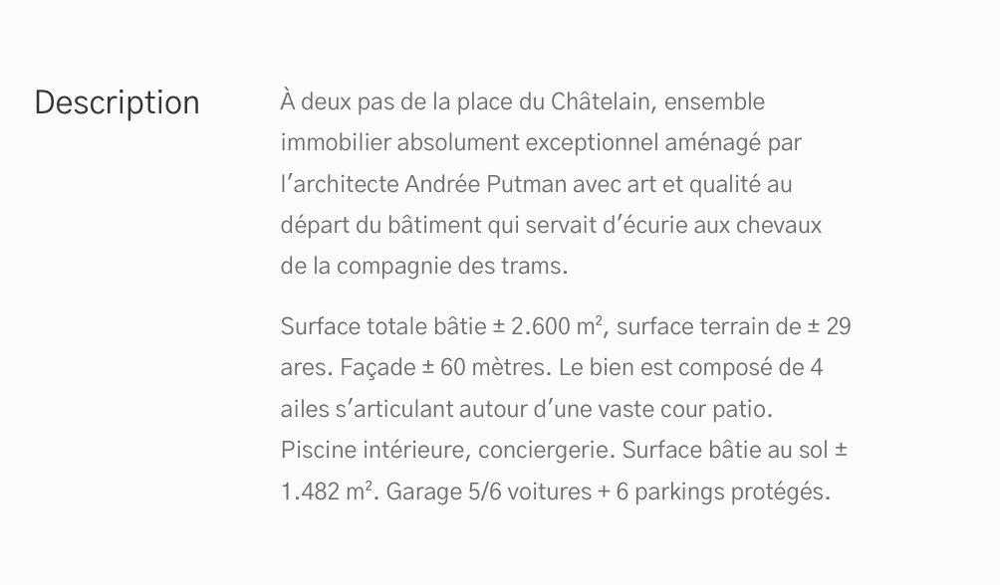

# Texte

---

## Propriétés

---

| nom   | type                 | requis | default | description |
| ----- | -------------------- | ------ | ------- | ----------- |
| title | Chaîne de caractères | oui    | null    | Le titre    |
| text  | Chaîne de caractères | oui    | null    | Le texte    |

## Composants

---

## Comportement

---
